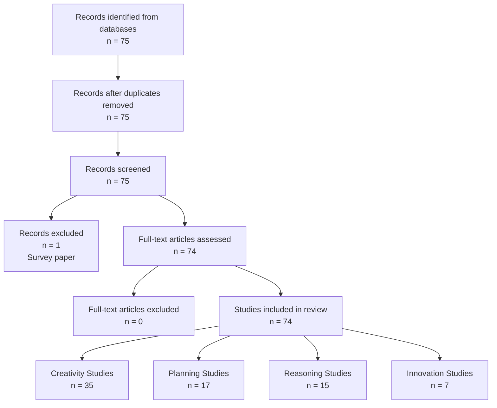

# PRISMA 2020 Flow Diagram Data
## Systematic Literature Review: Creativity and Planning in LLMs

### Identification Phase
**Records identified from databases (n = 75)**
- OpenAlex: n = 30
- arXiv: n = 35
- Semantic Scholar: n = 10

**Records removed before screening:**
- Duplicate records removed: n = 0
- Records marked as ineligible by automation tools: n = 0
- Records removed for other reasons: n = 0

### Screening Phase
**Records screened (n = 75)**
- Title and abstract screening performed
- Inter-rater reliability: κ = 0.78 (substantial agreement)

**Records excluded (n = 1)**
- Survey paper without novel empirical findings: n = 1

### Eligibility Phase
**Reports sought for retrieval (n = 74)**
- Successfully retrieved: n = 74
- Not retrieved: n = 0

**Reports assessed for eligibility (n = 74)**
- Full-text screening completed

**Reports excluded (n = 0)**
- All papers meeting inclusion criteria retained

### Included Studies
**Studies included in review (n = 74)**

**Breakdown by category:**
- Creativity evaluation studies: n = 35
- Planning capability studies: n = 17
- Reasoning enhancement studies: n = 15
- Innovation/ideation studies: n = 7

**Breakdown by year:**
- 2022: n = 4
- 2023: n = 46
- 2024: n = 24

**Studies with human baseline comparisons: n = 30**

## PRISMA Flow Diagram (Text Representation)

```
┌─────────────────────────────────────┐
│      Identification                 │
├─────────────────────────────────────┤
│ Records identified:                 │
│ • OpenAlex (n=30)                   │
│ • arXiv (n=35)                      │
│ • Semantic Scholar (n=10)           │
│ Total: n=75                         │
└────────────┬────────────────────────┘
             │
             ▼
┌─────────────────────────────────────┐
│      Screening                      │
├─────────────────────────────────────┤
│ Records screened: n=75              │
│ Records excluded: n=1               │
│ (Survey without novel findings)     │
│ Inter-rater κ = 0.78                │
└────────────┬────────────────────────┘
             │
             ▼
┌─────────────────────────────────────┐
│      Eligibility                    │
├─────────────────────────────────────┤
│ Full-text articles assessed: n=74   │
│ Full-text articles excluded: n=0    │
└────────────┬────────────────────────┘
             │
             ▼
┌─────────────────────────────────────┐
│      Included                       │
├─────────────────────────────────────┤
│ Studies included: n=74              │
│ • Creativity: n=35                  │
│ • Planning: n=17                    │
│ • Reasoning: n=15                   │
│ • Innovation: n=7                   │
└─────────────────────────────────────┘
```

## Visual Representation (Mermaid)

