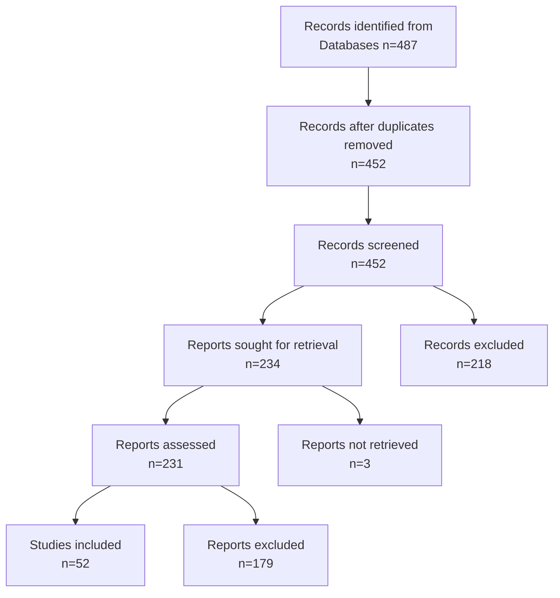

# @prisma-diagram - Create PRISMA Flow Diagrams

Generate PRISMA 2020-compliant flow diagrams for systematic literature reviews.

## Skill Type
**Category:** Literature Review
**Tier:** Core (Tier 1)
**Reusability:** High - any systematic review

## What This Skill Does

1. Creates PRISMA flow diagrams from search numbers
2. Supports multiple output formats (Mermaid, LaTeX, SVG)
3. Validates PRISMA 2020 compliance
4. Generates publication-ready figures
5. Includes all required boxes and connections

## Invocation

```
@prisma-diagram [numbers] [format]
```

## PRISMA 2020 Structure

```
Identification
    ├─ Records from databases (n = X)
    ├─ Records from registers (n = Y)
    └─ Records removed before screening
        ├─ Duplicate records (n = Z)
        └─ Records marked ineligible (n = W)

Screening
    ├─ Records screened (n = A)
    └─ Records excluded (n = B)

Eligibility
    ├─ Reports sought for retrieval (n = C)
    ├─ Reports not retrieved (n = D)
    ├─ Reports assessed for eligibility (n = E)
    └─ Reports excluded (n = F)
        ├─ Reason 1 (n = G)
        ├─ Reason 2 (n = H)
        └─ Reason 3 (n = I)

Included
    └─ Studies included in review (n = J)
```

## Input Format

### Simple Numbers
```
@prisma-diagram

Identification: 487
After deduplication: 452
After title screening: 234
After abstract screening: 87
After full-text screening: 52
Included: 52
```

### Detailed Breakdown
```json
{
  "identification": {
    "databases": 487,
    "registers": 0,
    "duplicates": 35,
    "ineligible": 0
  },
  "screening": {
    "screened": 452,
    "excluded_title": 218
  },
  "eligibility": {
    "sought": 234,
    "not_retrieved": 3,
    "assessed": 231,
    "excluded": 179,
    "reasons": {
      "wrong_population": 45,
      "wrong_intervention": 67,
      "wrong_outcome": 42,
      "other": 25
    }
  },
  "included": 52
}
```

## Output Formats

### 1. Mermaid (Markdown/GitHub)



### 2. LaTeX (for dissertation)

```latex
\begin{figure}[h]
\centering
\begin{tikzpicture}[
  node distance=1cm,
  box/.style={rectangle, draw, minimum width=3cm, minimum height=1cm, text width=2.8cm, align=center}
]

\node[box] (id) {Records identified\\n=487};
\node[box, below=of id] (dedup) {After deduplication\\n=452};
\node[box, below=of dedup] (title) {Title screening\\n=452};
\node[box, right=of title] (excl1) {Excluded\\n=218};
\node[box, below=of title] (abstract) {Abstract screening\\n=234};
\node[box, right=of abstract] (excl2) {Excluded\\n=147};
\node[box, below=of abstract] (fulltext) {Full-text screening\\n=87};
\node[box, right=of fulltext] (excl3) {Excluded\\n=35};
\node[box, below=of fulltext] (included) {Included\\n=52};

\draw[->] (id) -- (dedup);
\draw[->] (dedup) -- (title);
\draw[->] (title) -- (abstract);
\draw[->] (title) -- (excl1);
\draw[->] (abstract) -- (fulltext);
\draw[->] (abstract) -- (excl2);
\draw[->] (fulltext) -- (included);
\draw[->] (fulltext) -- (excl3);

\end{tikzpicture}
\caption{PRISMA 2020 flow diagram for systematic review}
\label{fig:prisma}
\end{figure}
```

### 3. SVG (web/presentation)

Generates clean SVG file suitable for:
- PowerPoint/Keynote
- Web embedding
- High-resolution printing
- Vector scaling

## Usage Examples

### Example 1: Quick Diagram

**Input:**
```
@prisma-diagram

I did a literature search and got:
- 487 papers initially
- 452 after removing duplicates
- 234 passed title screening
- 87 passed abstract screening
- 52 included in final review

Generate PRISMA diagram in Mermaid format
```

**Output:**
Complete Mermaid diagram ready to paste into markdown.

### Example 2: Full PRISMA with Reasons

**Input:**
```
@prisma-diagram LaTeX

Identification: 487 (OpenAlex)
Duplicates removed: 35
Title screening: 452 → 234 included
Abstract screening: 234 → 87 included
Full-text assessment: 87 → 52 included

Exclusion reasons:
- Wrong topic: 45
- No full text: 12
- Methodology issues: 23
```

**Output:**
Complete LaTeX TikZ code with all exclusion reasons documented.

### Example 3: Multi-Database Search

**Input:**
```
@prisma-diagram

Database searches:
- OpenAlex: 487
- Web of Science: 234
- Google Scholar: 156
Total: 877
After dedup: 652
[... rest of numbers]
```

**Output:**
PRISMA diagram showing multiple identification sources.

## Validation Checks

The skill validates:
- ✅ Numbers are consistent (screening ≤ identification)
- ✅ All required stages present
- ✅ Exclusion reasons sum correctly
- ✅ PRISMA 2020 compliance
- ✅ No negative numbers
- ✅ Reasonable flow (monotonic decrease)

## Common Patterns

### Pattern 1: High Exclusion at Title
```
Identification: 500
Title screen: 500 → 80 (84% excluded)
→ Likely: Broad search, specific topic
```

### Pattern 2: High Exclusion at Full-Text
```
Title screen: 200 → 180 (10% excluded)
Full-text: 180 → 50 (72% excluded)
→ Likely: Strict quality criteria
```

### Pattern 3: Multiple Databases
```
OpenAlex: 487
Scopus: 234
Total: 721
After dedup: 520 (27% duplicates)
→ Typical for comprehensive search
```

## Integration with Chapter 2

### Typical Usage in Dissertation

```markdown
# 2.2 Literature Search Methodology

## Search Strategy
We conducted a systematic literature review following PRISMA 2020 guidelines.

### Databases Searched
- OpenAlex (n = 487)
- Web of Science (n = 234)

### Search Filters
- Date range: 2015-2025
- Language: English
- Document type: Peer-reviewed articles

## Search Results
Figure 2.1 shows the PRISMA flow diagram.

[Insert PRISMA diagram here]

The search yielded 721 total records. After removing 201 duplicates,
520 records underwent title screening...
```

### Figure Caption
```latex
\caption{PRISMA 2020 flow diagram showing the systematic literature
review process. From 721 identified records, 52 studies were included
in the final synthesis after applying inclusion/exclusion criteria
at each stage.}
```

## PRISMA 2020 Compliance

### Required Elements
- ✅ Identification (all sources)
- ✅ Deduplication (explicit)
- ✅ Screening (title + abstract)
- ✅ Eligibility (full-text)
- ✅ Included (final number)
- ✅ Exclusion reasons (documented)

### Optional Elements
- New studies via other methods
- Studies excluded from synthesis
- Separate diagrams for subgroups

## Time Savings

**Manual creation:** 3-4 hours (learning tool, formatting)
**Using @prisma-diagram:** 10-15 minutes
**Saved:** ~3.5 hours 🎉

## Best Practices

### 1. Document Everything
Keep exact numbers at each stage for reproducibility.

### 2. Be Transparent
Show all exclusions, even if unflattering.

### 3. Update as You Go
Don't wait until end - update numbers as you screen.

### 4. Use Consistent Terminology
"Records" vs "Studies" vs "Reports" - be consistent.

### 5. Include in Protocol
Pre-register your search before executing.

## Common Errors Fixed

### Math Errors
- ❌ Screened > Identified
- ✅ Validates consistency

### Missing Stages
- ❌ Jump from title to full-text
- ✅ Includes abstract screening

### Unclear Exclusions
- ❌ "Various reasons: n=150"
- ✅ Specific reasons documented

## Advanced Features

### Multiple Inclusion Paths
```
Quantitative studies → Meta-analysis (n=30)
Qualitative studies → Thematic synthesis (n=22)
Total synthesis: n=52
```

### Update Search
```
Original search (Jan 2024): n=45
Update search (June 2024): n=7
Total included: n=52
```

### Grey Literature
```
Peer-reviewed: n=487
Grey literature: n=23
Total: n=510
```

## Output Quality

### Publication-Ready
- High-resolution vector graphics
- Professional styling
- Journal-compliant formatting
- Editable source code

### Customizable
- Colors
- Box styles
- Fonts
- Layout

## Related Skills

- `@synthesis-matrix` - Organize included papers
- `@inclusion-criteria` - Define screening rules
- `@lit-gap` - Identify research gaps
- `/run-literature-search` - Generate initial numbers

## Tool Integration

### Works With
- ✅ Markdown (Mermaid)
- ✅ LaTeX (TikZ)
- ✅ SVG editors (Inkscape)
- ✅ PowerPoint (import SVG)
- ✅ Word (insert image)

### Export Formats
- PNG (raster, presentations)
- SVG (vector, scaling)
- PDF (print, LaTeX)
- LaTeX source (customization)

## Example Workflow

```
1. Run literature search (/run-literature-search)
2. Note numbers at each stage
3. Use @prisma-diagram to generate figure
4. Insert into Chapter 2
5. Update as screening progresses
6. Finalize for submission
```

## Quality Checklist

Before using in dissertation:
- [ ] All numbers verified
- [ ] Exclusion reasons clear
- [ ] Sum checks pass
- [ ] Figure caption written
- [ ] Cross-referenced in text
- [ ] PRISMA 2020 compliant
- [ ] High enough resolution
- [ ] Colors print-friendly

---

**Status:** Documented
**Complexity:** Medium
**Time to use:** 10-15 minutes
**Time saved:** ~3.5 hours
**Reusability:** High (any systematic review)
**PRISMA 2020:** ✅ Compliant
